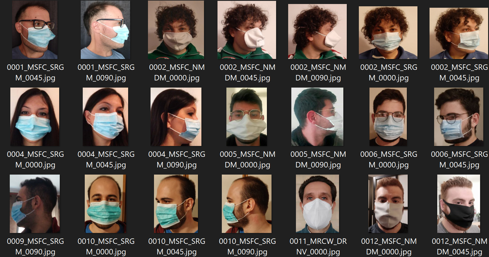

  

# Ways-to-Wear-a-Face-Mask

This repo contains a CSV file that maps images from the [Ways to Wear a Mask or a Respirator (WWMR-DB)](https://ieee-dataport.org/open-access/ways-wear-mask-or-respirator-wwmr-db) dataset 1 to the following numeric labels:

0 - mask above chin 
1 - mask worn correctly 
2 - mask hanging from wearer's ear 
3 - mask not worn 
4 - mask on forehead 
5 - mask on tip of nose 
6 - mask under chin 
7 - mask under nose

This can be used to build and train an ML model in PerceptiLabs that can detect the presence and correct positioning of face masks (e.g., for protecting against COVID-19).

# Structure

This repo contains the following structure:

- **mask_log.csv**: CSV file for use in loading the data into PerceptiLabs.

The following shows a partial example of the data stored in **mask_log.csv** that is used to load the data into PerceptiLabs. The values in the **target** column indicate the respective mask-wearing state depicted in each image.

| **image_path** | **target** |
|------------|--------------|
| Mask_Above_Chin/0001_MSFC_NMDM_0000.jpg | 0 |
| Mask_Correctly_worn/0001_MRCW_DRNV_0000.jpg | 1 |
| Mask_Hanging_From_Ear/0001_MRHN_DRNV_0000.jpg | 2 |
| Mask_Not_Worn/0001_MRNW_0000.jpg | 3 |
| Mask_On_Forehead/0001_MRFH_DRNV_0000.jpg | 4 |
| Mask_On_Tip_Of_Nose/0001_MRTN_DRNV_0000.jpg | 5 |
| Mask_Under_Chin/0001_MRNC_DRNV_0000.jpg | 6 |
| Mask__Under_Nose/0001_MRNN_DRNV_0 | 7 |

Due to the large number of images in the dataset, the dataset itself must be downloaded from [https://ieee-dataport.org/open-access/ways-wear-mask-or-respirator-wwmr-db](https://ieee-dataport.org/open-access/ways-wear-mask-or-respirator-wwmr-db).

The following shows an example of images from the dataset:

  

# Community

Got questions, feedback, or want to join a community of machine learning practitioners working with exciting tools and projects? Check out our [Community](https://forum.perceptilabs.com/)!

1 Dataset Credits: https://ieee-dataport.org/open-access/ways-wear-mask-or-respirator-wwmr-db
